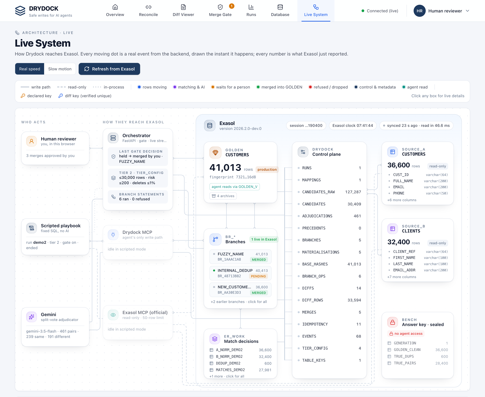
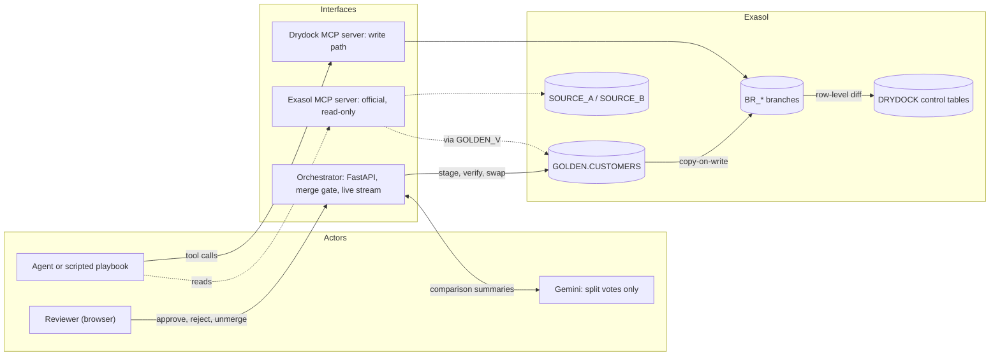
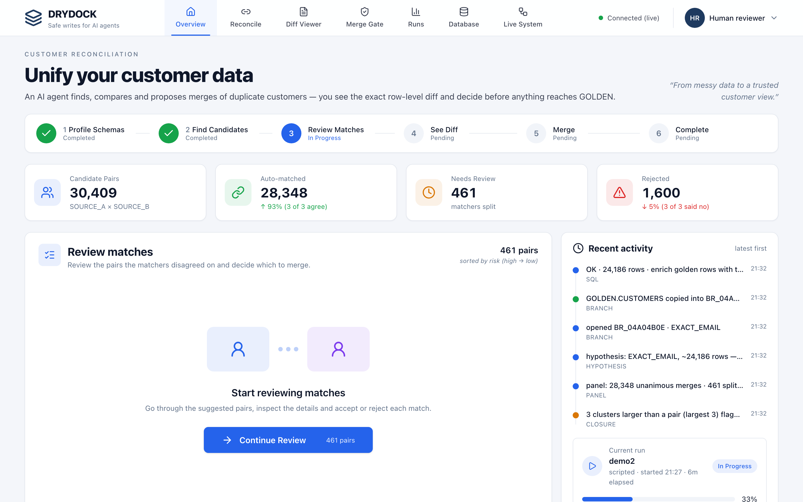

# Drydock

**Safe writes for AI agents on Exasol.**

AI agents can now reach databases through MCP. Reading is easy; writing is where it gets dangerous. Drydock is a
governed write path: the agent never touches production. It works on a **branch** (a real copy inside Exasol), a
person sees the **exact rows** that would change and approves them row by row, and every merge can be **undone
exactly**.



| | |
|---|---|
| **Demo video** | _coming soon_ |
| **Pitch deck** | [docs/pitch/Drydock-Pitch-Deck.pdf](docs/pitch/Drydock-Pitch-Deck.pdf) · [speaker script](docs/pitch/script.md) |
| **Run it yourself** | [Getting started](#getting-started) (about 20 minutes) |
| **Source code** | [Project structure](#project-structure) |

---

## Contents

1. [How it works](#how-it-works)
2. [Results on a live Exasol instance](#results-on-a-live-exasol-instance)
3. [Getting started](#getting-started)
4. [Using Drydock](#using-drydock)
5. [Running the tests](#running-the-tests)
6. [Deployment](#deployment)
7. [Troubleshooting](#troubleshooting)
8. [Project structure](#project-structure)
9. [Built to be trusted](#built-to-be-trusted)

---

## How it works

Most safeguards ask a person to approve an agent's **SQL text**, which is only a prediction of what it will do.
Drydock shows the **observed effect** instead.

| Step | What happens | Inside Exasol |
|---|---|---|
| **1. Branch** | The agent gets a private copy of the tables it writes. | `CREATE TABLE … AS SELECT` into its own schema |
| **2. Observe** | Any SQL runs on the branch. Drydock computes the exact row-level diff. | `HASH_SHA256` per row, full outer join on the key |
| **3. Gate** | Small, safe changes merge by themselves. Risky ones wait for a person, who approves row by row. | limits from `DRYDOCK.TIER_CONFIG` |
| **4. Merge** | The approved rows are staged, the result is fingerprint-checked, then swapped in atomically. | two `RENAME`s in one transaction |
| **5. Undo** | Unmerge restores the table, and the fingerprint proves it byte for byte. | the archived table is renamed back |

Discarding a branch is `DROP SCHEMA … CASCADE`. Production was never touched, so there is nothing to roll back.



**Who can do what.** Exasol itself enforces the boundaries. The agent's database user can only *read* the two
source systems and a view of GOLDEN. Every write goes through Drydock's service user, and exactly one module
(`drydock/merge.py`) ever writes GOLDEN.

### The demo workload: customer reconciliation

Two messy customer systems (`SOURCE_A`, 36,600 rows; `SOURCE_B`, 32,400 rows) must be merged into one clean list,
`GOLDEN`. The data is synthetic, with 400 planted look-alikes: fathers and sons, spouses sharing a landline, people
and their companies.

- Blocking rules in SQL find 30,409 candidate pairs.
- **Three matchers vote in SQL, inside Exasol** (deterministic, probabilistic, skeptic) and settle 98.5% of them.
- Only the 461 pairs they disagree on go to **Gemini**, as a comparison summary such as *"email identical; dates of
  birth 30 years apart"*. It never sees names, emails, phones, addresses or dates. Its verdict is advice: those rows
  still wait for a person.



---

## Results on a live Exasol instance

Measured on Exasol Personal 2026.2 on a laptop: a scripted run with the gate on (tier 2), then a person reviewing the
held requests in the UI.

**The matcher** (verdicts before any person looks):

| | |
|---|---|
| Merges proposed | 27,981, of which **27,980 correct** (precision 0.99996) |
| True matches found | 27,980 of 28,000 (recall 0.9993, F1 0.9996) |
| Internal duplicates | 600 of 600 found, 0 wrong |

**The gate** (what actually reached GOLDEN):

| Match class | Rows changed | Held for a person (split votes) | Applied after review |
|---|---|---|---|
| EXACT_EMAIL | 24,186 | 184 | 24,002 |
| PHONE_ADDRESS | 3,174 | 10 | 3,164 |
| FUZZY_NAME | 621 | 35 | 586 |
| NEW_CUSTOMERS | 4,413 | 0 (merged automatically, within limits) | 4,413 |
| INTERNAL_DEDUP | 1,200 | whole request held: it would delete 1.46% of GOLDEN, and the tier allows 1% | — |

**Engine timings on the laptop:**

| Operation | Rows | Time |
|---|---|---|
| Copy the customer table into a branch | 36,600–41,013 | about 1 s |
| Row-level diff | 24,186 changed | about 1.3 s |
| Swap the merged table in | whole table | 15–35 ms |
| Discard a branch | whole branch | about 35 ms |

**Tests:** 38 live tests against Exasol, 274 offline Python tests and 15 UI tests. `scripts/probe_all.py` runs every
SQL statement the product can issue against the instance (57 statements, 0 errors).

---

## Getting started

This takes about 20 minutes the first time. You'll type a few commands into a **terminal** (on a Mac: open the app
called *Terminal*). Copy each command, paste it, and press **Enter**.

### What you need

| Thing | Why | How to get it |
|---|---|---|
| A Mac or Linux computer | Drydock and Exasol run locally | — |
| **Exasol Personal** | the database | [github.com/exasol/exasol-personal](https://github.com/exasol/exasol-personal) |
| **uv** | runs the Python code and installs its libraries | `curl -LsSf https://astral.sh/uv/install.sh \| sh` |
| **Node.js 22+** | builds the web interface | [nodejs.org](https://nodejs.org) (or `brew install node`) |
| A **Gemini API key** | the AI adjudicator | free at [aistudio.google.com/apikey](https://aistudio.google.com/apikey) |

### Step 1: Start Exasol

Install Exasol Personal using the instructions on its GitHub page, then start a local database:

```bash
exasol install local
```

Check that it's running:

```bash
exasol info
```

You should see `Deployment State: running`. The admin password Exasol created for you is in
`~/.exasol/personal/deployments/default/secrets.json`; you'll need it in step 3.

### Step 2: Download Drydock

```bash
git clone https://github.com/paramvansh01/DryDock.git
cd DryDock
uv sync
```

`uv sync` downloads the right Python version and every library Drydock needs. It only takes a minute.

### Step 3: Fill in your settings

Make your own settings file from the example:

```bash
cp .env.example .env
```

Open `.env` in any text editor and fill in four things:

| Setting | What to put there |
|---|---|
| `EXA_ADMIN_PASSWORD` | the admin password from step 1 |
| `DRYDOCK_SVC_PASSWORD` | make up a strong password (for Drydock's writer account) |
| `DRYDOCK_AGENT_PASSWORD` | make up a different strong password (for the read-only agent account) |
| `GEMINI_API_KEY` | your Gemini key |

Leave everything else as it is. `.env` holds passwords, so it is never uploaded to GitHub.

### Step 4: Create the two database users

```bash
uv run python scripts/create_users.py
```

This creates a **writer** account (Drydock's service) and a **read-only** account (the agent) inside Exasol. You'll
see `created` for each.

### Step 5: Pick a secret word, then check the database

Drydock runs a check-up on your database and seals the report with a **secret word only you know**, so nobody can
quietly edit the results later. Type this, then enter any secret of 12+ characters. Nothing appears on screen while
you type; that's normal.

```bash
read -s "DRYDOCK_VERIFY_KEY?Secret word (hidden): "; export DRYDOCK_VERIFY_KEY; echo
```

> On Linux (bash) use: `read -s -p "Secret word (hidden): " DRYDOCK_VERIFY_KEY; export DRYDOCK_VERIFY_KEY; echo`

Now run the check-up (about a minute):

```bash
uv run python scripts/verify.py
```

It asks Exasol questions such as "can a table be renamed inside a transaction?" and prints `PASS`, `FAIL` or
`UNKNOWN` for each. Where an optional Exasol feature isn't installed (such as the in-database AI functions),
Drydock automatically uses its alternative, so a few `FAIL` lines are normal. Keep this terminal window open: the next steps need the secret word too.

### Step 6: Load the demo data

```bash
uv run python scripts/setup.py --seed 20260913
```

This creates Drydock's tables and loads the two customer systems (69,000 synthetic records). It ends with a line like
`recorded 40 executed statements`.

### Step 7: Build the web interface

```bash
cd ui && npm install && npm run build && cd ..
```

### Step 8: Start Drydock

```bash
uv run uvicorn drydock.orchestrator:app --port 8765
```

Leave it running, and open **http://localhost:8765** in your browser. You should see a green **Connected (live)**
at the top.

---

## Using Drydock

### Your first run

1. On the **Reconcile** tab, click **Start New Run**. Keep **scripted**, **Gate enabled** and **Tier 2**, then click
   **Start**.
2. Open the **Live System** tab and watch. Every moving dot is a real event: branches being copied, diffs computed,
   the gate deciding. A run takes about six minutes.
3. When it finishes, open **Merge Gate**. The requests that were held for you are waiting there, each with the
   reason it was held.
4. Open **Diff Viewer** to see every changed row side by side. Untick anything that looks wrong.
5. Back on **Merge Gate**, click **MERGE N OF M**. To undo it, click **unmerge** on its card in the Diff Viewer.

### The screens

| Tab | What it's for |
|---|---|
| **Overview** | progress of the current run and recent activity |
| **Reconcile** | every candidate pair, with the matchers' votes and Gemini's verdict |
| **Diff Viewer** | the exact rows a branch would change; tick or untick each one |
| **Merge Gate** | requests waiting for you: **MERGE**, **REJECT** (with a reason, which becomes a precedent) or **DISCARD** |
| **Runs** | the scoreboard: precision, recall, F1 and the gate's safety score |
| **Database** | GOLDEN's row count and fingerprint history |
| **Live System** | the architecture, live, with what Exasol reports right now; **Refresh from Exasol** re-reads it |

### Next time

Open a terminal in the `DryDock` folder, set your secret word again (step 5, first command only), and start Drydock
(step 8). To start over with fresh data:

```bash
uv run python scripts/reset.py --wipe-precedents
```

---

## Running the tests

```bash
uv run pytest                                   # offline tests: no database needed
cd ui && npm test && cd ..                      # web interface tests
DRYDOCK_LIVE=1 uv run pytest tests/test_invariants.py -v   # live tests against your Exasol (resets GOLDEN)
uv run python scripts/probe_all.py              # runs every product SQL statement against Exasol
uv run python scripts/dialect_lint.py           # checks all SQL for non-Exasol syntax
```

The live tests and `probe_all.py` need the secret word from step 5 in the same terminal.

---

## Deployment

**Local (recommended):** the steps above run everything on one machine: Exasol Personal, the Python orchestrator
(which also serves the web interface) and your browser.

**A remote Exasol:** set `EXA_DSN` in `.env` to the server's `host:port`, put its certificate fingerprint in
`EXA_CERT_FINGERPRINT` and set `EXA_TLS_NOCERTCHECK=0`. Then follow steps 4–8 as usual.

**Orchestrator in Docker (optional):** `docker-compose.yml` runs the orchestrator in a container while Exasol runs
elsewhere. Build the UI first (step 7), export your secret word, and set `EXA_DSN=host.docker.internal:8563` if Exasol
runs on the same machine:

```bash
docker compose up
```

**The autonomous agent:** `uv run python -m agent.loop --run-id my-run --tier 2` runs Gemini as the planner, reaching
Exasol only through the two MCP servers. For full autonomous runs, use a Gemini key with billing enabled.

---

## Troubleshooting

| You see | What to do |
|---|---|
| `IDENTITY MISSING` or `cannot connect` | Is Exasol running? `exasol info` should say `running`. Check the passwords in `.env`. |
| `DRYDOCK_VERIFY_KEY is not set` / `UNSIGNED-KEY-MISSING` | This terminal doesn't know your secret word. Run the first command of step 5 again. |
| `required verification not PASS` | Run `uv run python scripts/verify.py` again (step 5). |
| `address already in use` on port 8765 | Drydock is already running somewhere. Stop it with `lsof -ti :8765 \| xargs kill`. |
| Pairs show **AI unavailable** | Your Gemini key has used today's free requests. Those pairs wait for a person as usual; enable billing on the key for unlimited runs. |
| The page says **Orchestrator offline** | The terminal running step 8 was closed. Start it again. |
| **Refresh from Exasol** says "Not Found" | The orchestrator is an older copy. Stop it (Ctrl+C) and run step 8 again. |

---

## Project structure

```
drydock/            the governed write path
  branch.py         open, copy-on-write, run agent SQL in a branch, discard, expiry
  retarget.py       redirects the agent's table references into its branch (pure, heavily tested)
  diff.py           row-level diff, computed in Exasol
  hashing.py        row hashes and table fingerprints
  gate.py           risk gate and hard blocks
  merge.py          the only code that writes GOLDEN: stage, verify, swap, unmerge
  er.py             entity resolution: blocking, scoring, the three-matcher panel, clustering
  adjudicate.py     Gemini adjudication of split pairs (and the optional in-database model)
  precedent.py      reviewer decisions reused as precedents
  orchestrator.py   FastAPI app: web interface, live events, reviewer actions
  mcp_server.py     the Drydock MCP server (the agent's write path)
  system.py         live Exasol metadata for the Live System view
  db.py, lintguard.py, catalogue.py   database access with a built-in SQL dialect firewall
agent/              the Gemini planner loop and the scripted playbook
bench/              synthetic data generator, source schemas and scoring
sql/                DDL, grants and Exasol dialect evidence (DIALECT.md)
scripts/            setup, verification, probing, reset, user creation
tests/              offline tests and the live invariant suite
ui/                 React + Vite + Tailwind web interface
docs/               pitch deck, speaker script, screenshots
```

---

## Built to be trusted

| Guarantee | How | Where |
|---|---|---|
| Only Exasol SQL reaches the database | every statement passes a dialect firewall first | `drydock/db.py`, `drydock/lintguard.py` |
| Every table and column name is real | checked against a catalogue derived from the project's own DDL | `drydock/catalogue.py` |
| Every Exasol behaviour it relies on is proven | checked live, with the exact statement and output recorded | `scripts/verify.py`, `sql/DIALECT.md` |
| Verification results can't be edited | HMAC-signed with a key that is never stored in a file | `drydock/verification.py` |
| The tests stay as strict as they were written | live test assertions are locked by a guard test | `tests/invariants.lock.json` |
| What you see is live | the interface renders only the live event stream; animations start only for new events | `ui/src/views/System.tsx` |
| Scores are independent | computed from a ground truth the agent has no access to, through a reviewer-only endpoint | `bench/score.py` |
