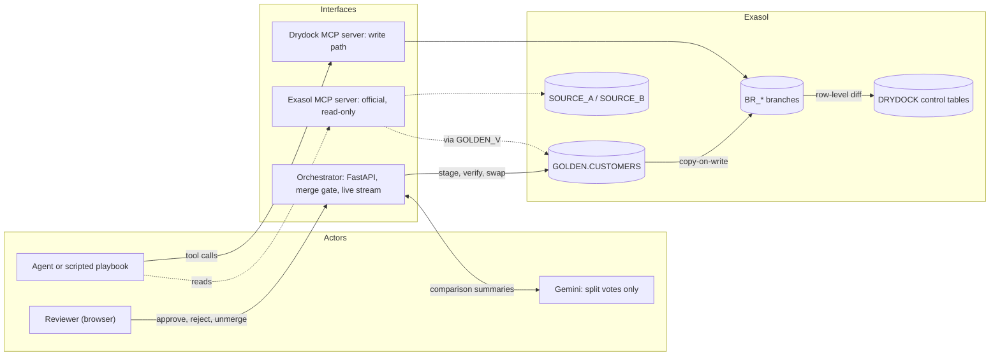

<p align="center">
  
  &nbsp;&nbsp;&nbsp;
  
</p>

# Drydock

<p align="center">
  <a href="https://drive.google.com/file/d/1YiVW0ad95-Zgrk_QQWo7Z6H26xkKM-1h/view?usp=sharing">
    
  </a>
  &nbsp;
  <a href="demo%20video.mp4">
    
  </a>
</p>

**Safe writes for AI agents on Exasol.**

AI agents can now reach databases through MCP. Reading is easy; writing is where it gets dangerous. Drydock is a
governed write path: the agent never touches production. It works on a **branch** (a real copy inside Exasol), a
person sees the **exact rows** that would change and approves them row by row, and every merge can be **undone
exactly**.

It runs on the included demo data or on **your own two customer files**, and a guided tour walks a first-time user
through every screen.


| | |
|---|---|
| **Demo video** | [▶ Google Drive](https://drive.google.com/file/d/1YiVW0ad95-Zgrk_QQWo7Z6H26xkKM-1h/view?usp=sharing) &nbsp;\| [▶ Local file](demo%20video.mp4) |
| **Pitch deck** | [Drydock Pitch Deck.pdf](Drydock%20Pitch%20Deck.pdf) |
| **Source code** | [Project structure](#project-structure) |

---

## What's new about Drydock

Today, an AI agent that can write to a database is trusted with a SQL statement. A person may read the statement
first, but a statement is only a prediction: nobody sees its effect until it has already happened, and undoing it
means a backup restore or hand-written reverse SQL. Drydock replaces trust in the statement with **evidence about its
effect**, enforced by the database itself.

| | The usual way | Drydock |
|---|---|---|
| **What a person approves** | the SQL text: a prediction | the rows that actually changed, observed on a real copy of production inside Exasol |
| **How much** | all or nothing | row by row: untick any row, and only the ticked rows ever reach production |
| **Proof the write matches the review** | none | the staged result must fingerprint to an independently computed "expected after" state, or nothing is swapped in |
| **Undo** | restore a backup, or write reverse SQL by hand | exact: the archived table is renamed back and its fingerprint proves byte-for-byte equality; changes are undone newest-first, so production only ever returns to a state that existed |
| **Who enforces the limits** | the agent's instructions | the database: the agent's user holds no write grant anywhere, and exactly one module writes production |
| **Deciding what needs a person** | fixed rules, or review everything | each change gets a risk price (rows × uncertainty × kind of change, deletes weighing most), checked against per-tier limits and a hard delete cap; the confidence bar rises each time a reviewer rejects a change as a wrong match, too broad or short of evidence |
| **Where the AI fits** | it makes the decision | Exasol makes the decisions in SQL (three matchers settle about 98% of pairs); Gemini only advises on the pairs they disagree on, sees a comparison summary (never a name, email, phone, address or date) and never writes |
| **What it assumes about the database** | untested | every database behaviour the design relies on (transactional DDL, rename rules, hashing) is checked on the live instance and signed; Drydock refuses to run without that proof |
| **Afterwards** | logs, if anyone kept them | a downloadable audit log (who decided what, when, why, fingerprints before and after), the exact change set for sign-off, and each customer's lineage: which source record every field came from |

Three ideas carry it:

1. **Branch production for every AI change.** Exasol copies a table fast enough (about a second for the 36,600-row
   customer table on a laptop) that a full, real copy per change can be the default instead of a special case.
2. **Approve effects, not intentions.** The diff is measured in the database by hashing every row, so the review is of
   what the SQL did, including side effects nobody predicted.
3. **Every decision becomes evidence.** Approvals, rejections and undos are recorded under the reviewer's name, and
   reviewers' decisions become case law the AI adjudicator is shown the next time a similar pair comes up.

The write path is written for the `GOLDEN` schema rather than for customers, and merges one table at a time: a change
that touches two tables is refused. Keyed tables get row-level review, keyless ones whole-table. It has been exercised
on `GOLDEN.CUSTOMERS`, the table the demo uses; customer reconciliation is the workload that demonstrates it.

---

## Contents

1. [Demo video](#demo-video)
2. [What's new about Drydock](#whats-new-about-drydock)
3. [How it works](#how-it-works)
4. [Results on a live Exasol instance](#results-on-a-live-exasol-instance)
5. [Getting started](#getting-started)
6. [Using Drydock](#using-drydock)
7. [Using your own data](#using-your-own-data)
8. [Reviewing, signing off and auditing](#reviewing-signing-off-and-auditing)
9. [Running the tests](#running-the-tests)
10. [Deployment](#deployment)
11. [Troubleshooting](#troubleshooting)
12. [Project structure](#project-structure)
13. [Built to be trusted](#built-to-be-trusted)

---

## Demo video

A full walkthrough of Drydock — from starting a reconciliation run to reviewing individual row diffs and merging into GOLDEN.

[▶ **Watch the demo (DEMO video.mp4)**](DEMO%20video.mp4)

---

## How it works

Most safeguards ask a person to approve an agent's **SQL text**, which is only a prediction of what it will do.
Drydock shows the **observed effect** instead.

| Step | What happens | Inside Exasol |
|---|---|---|
| **1. Branch** | The agent gets a private copy of the tables it writes. | `CREATE TABLE … AS SELECT` into its own schema |
| **2. Observe** | Any SQL runs on the branch. Drydock computes the exact row-level diff. | `HASH_SHA256` per row, full outer join on the key |
| **3. Gate** | Small, safe changes merge by themselves. Risky ones wait for a person, who approves row by row. | limits from `DRYDOCK.TIER_CONFIG` |
| **4. Merge** | The approved rows are staged, the result is fingerprint-checked, then swapped in atomically. | two `RENAME`s in one transaction |
| **5. Undo** | Unmerge restores the table, and the fingerprint proves it byte for byte. | the archived table is renamed back |

Discarding a branch is `DROP SCHEMA … CASCADE`. Production was never touched, so there is nothing to roll back.



**Who can do what.** Exasol itself enforces the boundaries. The agent's database user can only *read* the two
source systems and a view of GOLDEN. Every write goes through Drydock's service user, and exactly one module
(`drydock/merge.py`) ever writes GOLDEN.

### The demo workload: customer reconciliation

Two messy customer systems (`SOURCE_A`, 36,600 rows; `SOURCE_B`, 32,400 rows) must be merged into one clean list,
`GOLDEN`. The data is synthetic, with 400 planted look-alikes: fathers and sons, spouses sharing a landline, people
and their companies.

- Blocking rules in SQL find 30,409 candidate pairs.
- **Three matchers vote in SQL, inside Exasol** (deterministic, probabilistic, skeptic) and settle 98.5% of them.
- Only the 461 pairs they disagree on go to **Gemini**, as a comparison summary such as *"email identical; dates of
  birth 30 years apart"*. It never sees names, emails, phones, addresses or dates. Its verdict is advice: those rows
  still wait for a person.

The same pipeline runs on your own two files: see [Using your own data](#using-your-own-data).


---

## Results on a live Exasol instance

Measured on Exasol Personal 2026.2 on a laptop: a scripted run with the gate on (tier 2), then a person reviewing the
held requests in the web interface.

**The contribution is the gate and the undo, not the matcher.** The demo data is synthetic, so the matcher's accuracy
on it (at the end of this section) only shows that the pipeline is wired correctly. What carries over to any data is
what the gate did with the proposed changes, what the undo guarantees, and how fast Exasol makes it.

**What the gate did with five proposed changes** (what actually reached GOLDEN):

| Change | Rows changed | Held for a person (the matchers disagreed) | Applied after review |
|---|---|---|---|
| EXACT_EMAIL | 24,186 | 184 | 24,002 |
| PHONE_ADDRESS | 3,174 | 10 | 3,164 |
| FUZZY_NAME | 621 | 35 | 586 |
| NEW_CUSTOMERS | 4,413 | 0 (merged automatically, within limits) | 4,413 |
| INTERNAL_DEDUP | 1,200 | whole request held: it would delete 1.46% of GOLDEN, and the tier allows 1% | — |

One change merged by itself because it was small and safe. In three, the rows the matchers disagreed on started
unticked and waited for a person, while the rest merged when the person approved. One was held whole because of
how much it would delete. In a live run on 15 September the matcher wrongly proposed one merge, of a planted
look-alike; with the gate on and nobody reviewing, it never reached GOLDEN (the end-of-run score counts zero false
merges in GOLDEN). Live test 18.11 checks the same property for each of the 400 look-alikes.

**What the undo guarantees.** Every merge keeps the table it replaced. Undo renames it back, then compares the
restored table's fingerprint (an order-independent sum of per-row SHA-256 hashes) with the one taken before the
merge (live test 18.9, and `tests/test_live_unmerge.py`, which approves two changes in the reverse of the order they
were requested and checks that only the one applied last can be undone first). Undo goes newest-applied first, and refuses if the table has changed since the merge in any
way the merge ledger doesn't know about, so it can never silently discard later work.

**Engine timings on the laptop:**

| Operation | Rows | Time |
|---|---|---|
| Copy the customer table into a branch | 36,600–41,013 | about 1 s |
| Row-level diff | 24,186 changed | about 1.3 s |
| Swap the merged table in | whole table | 15–35 ms |
| Discard a branch | whole branch | about 35 ms |

**The matcher, as a sanity check.** `bench/generate.py` writes both systems and a sealed answer key from a fixed seed,
with 400 planted look-alikes (fathers and sons, spouses sharing a phone, people and their companies). Scored against
that key, the matcher proposed 27,981 merges, of which 27,980 were correct, and found 27,980 of the 28,000 true
matches and all 600 internal duplicates. We generated this data ourselves, so treat these numbers as evidence that
the pipeline works, not as a claim about accuracy on real customer data, which depends on the data. Drydock's answer to
an imperfect matcher is the gate: uncertain pairs wait for a person whatever the matcher's score.

**Tests:** 40 live tests against Exasol (all passing on 15 September, on the code in this repository), 353 offline
Python tests and 28 web-interface tests. `scripts/probe_all.py` runs every SQL statement the product can issue
against the instance and records each outcome.

---

## Getting started

This takes about 20 minutes the first time. You'll type a few commands into a **terminal** (on a Mac: open the app
called *Terminal*). Copy each command, paste it, and press **Enter**.

### What you need

| Thing | Why | How to get it |
|---|---|---|
| A Mac or Linux computer | Drydock and Exasol run locally | — |
| **Exasol Personal** | the database | [github.com/exasol/exasol-personal](https://github.com/exasol/exasol-personal) |
| **uv** | runs the Python code and installs its libraries | `curl -LsSf https://astral.sh/uv/install.sh \| sh` |
| **Node.js 22+** | builds the web interface | [nodejs.org](https://nodejs.org) (or `brew install node`) |
| A **Gemini API key** | the AI adjudicator | free at [aistudio.google.com/apikey](https://aistudio.google.com/apikey) |

### Step 1: Start Exasol

Install Exasol Personal using the instructions on its GitHub page, then start a local database:

```bash
exasol install local
```

Check that it's running:

```bash
exasol info
```

You should see `Deployment State: running`. The admin password Exasol created for you is in
`~/.exasol/personal/deployments/default/secrets.json`; you'll need it in step 3.

### Step 2: Download Drydock

```bash
git clone https://github.com/paramvansh01/DryDock.git
cd DryDock
uv sync
```

`uv sync` downloads the right Python version and every library Drydock needs. It only takes a minute.

### Step 3: Fill in your settings

Make your own settings file from the example:

```bash
cp .env.example .env
```

Open `.env` in any text editor and fill in four things:

| Setting | What to put there |
|---|---|
| `EXA_ADMIN_PASSWORD` | the admin password from step 1 |
| `DRYDOCK_SVC_PASSWORD` | make up a strong password (for Drydock's writer account) |
| `DRYDOCK_AGENT_PASSWORD` | make up a different strong password (for the read-only agent account) |
| `GEMINI_API_KEY` | your Gemini key |

Leave everything else as it is. `.env` holds passwords, so it is never uploaded to GitHub.

### Step 4: Create the two database users

```bash
uv run python scripts/create_users.py
```

This creates a **writer** account (Drydock's service) and a **read-only** account (the agent) inside Exasol. You'll
see `created` for each.

### Step 5: Pick a secret word, then check the database

Drydock runs a check-up on your database and seals the report with a **secret word only you know**, so nobody can
quietly edit the results later. Type this, then enter any secret of 12+ characters. Nothing appears on screen while
you type; that's normal.

```bash
read -s "DRYDOCK_VERIFY_KEY?Secret word (hidden): "; export DRYDOCK_VERIFY_KEY; echo
```

> On Linux (bash) use: `read -s -p "Secret word (hidden): " DRYDOCK_VERIFY_KEY; export DRYDOCK_VERIFY_KEY; echo`

Now run the check-up (about a minute):

```bash
uv run python scripts/verify.py
```

It asks Exasol questions such as "can a table be renamed inside a transaction?" and prints `PASS`, `FAIL` or
`UNKNOWN` for each. Where an optional Exasol feature isn't installed (such as the in-database AI functions),
Drydock automatically uses its alternative, so a few `FAIL` lines are normal. Keep this terminal window open:
the next steps need the secret word too.

### Step 6: Load the demo data

```bash
uv run python scripts/setup.py --seed 20260913
```

This creates Drydock's tables and loads the two customer systems (69,000 synthetic records). It ends with a line like
`recorded 40 executed statements`.

### Step 7: Build the web interface

```bash
cd ui && npm install && npm run build && cd ..
```

### Step 8: Start Drydock

```bash
uv run uvicorn drydock.orchestrator:app --port 8765
```

Leave it running, and open **http://localhost:8765** in your browser. You should see a green **Connected (live)**
at the top.

---

## Using Drydock

### Your first run

1. On the **Reconcile** tab, click **Start New Run**. Keep **scripted**, **Gate enabled** and **Tier 2**, then click
   **Start**.
2. Open the **Live System** tab and watch. Every moving dot is a real event: branches being copied, diffs computed,
   the gate deciding. A run takes about six minutes.
3. When it finishes, open **Merge Gate**. The requests that were held for you are waiting there, each with the
   reason it was held.
4. Open **Diff Viewer** to see every changed row side by side. Untick anything that looks wrong.
5. Back on **Merge Gate**, click **MERGE N OF M**. To undo it, click **unmerge** on its card in the Diff Viewer.
   Changes are undone newest-first, so the list only ever returns to a state that really existed.

New to all this? Press **?** at the top right for a two-minute guided tour of every screen.

### The screens

| Tab | What it's for |
|---|---|
| **Your Data** | what Drydock is working on, a "ready to run?" checklist, and loading your own two files |
| **Overview** | progress of the current run and recent activity |
| **Reconcile** | every candidate pair, with the matchers' votes and Gemini's verdict |
| **Diff Viewer** | the exact rows a branch would change; tick or untick each one |
| **Merge Gate** | requests waiting for you: **MERGE**, **REJECT** (with a reason, which becomes a precedent) or **DISCARD** |
| **Runs** | the scoreboard (demo data only: it needs the answer key), the run diary, and the audit log download |
| **Database** | browse every table a page at a time (read-only), download any of them, and open one customer's full history |
| **Live System** | the architecture, live, with what Exasol reports right now; **Refresh from Exasol** re-reads it |

### Next time

Open a terminal in the `DryDock` folder, set your secret word again (step 5, first command only), and start Drydock
(step 8). To start over with fresh data:

```bash
uv run python scripts/reset.py --wipe-precedents
```

Stop Drydock (Ctrl+C) before a reset: the running server keeps the history it replays to browsers in memory.

---

## Using your own data

Drydock works on any two customer lists, not just the demo. Open **Your Data** and follow the four steps:

1. **Upload both files.** CSV, up to 50 MB and 300,000 rows each; from Excel use *File › Save As › CSV UTF-8*.
   **System A** is the list you trust most (the clean list starts from it); **System B** is the list you want to
   fold in. Comma, semicolon and tab separators and Windows encodings are detected for you.
2. **Tell Drydock which column is which.** It suggests a mapping from the column names and the values (an unlabelled
   column full of `@` is the email). Names can be one column or first and last. Dates are read in the format you
   confirm, and when `03/04/1985` could be either way round, Drydock asks.
3. **Check the data.** Every row is read with your choices, and nothing is loaded yet. You get a plain-language
   report: duplicate or missing IDs (these must be fixed), bad emails and dates (left blank), values that were too
   long, and contact details shared by many customers (an office line), which can make different people look alike.
4. **Load it.** Both files are copied into Exasol (schema `UPLOADS`, never the demo's sources) and the uploaded
   copies are deleted from the server. Then start a run: scripted mode, exactly as with the demo.

No files to hand? Download the two sample files on the same screen. **Use the demo data instead** switches back at
any time.

What's different with your own data: there is no answer key, so runs are not scored, and your review is the check.
Agent mode, where Gemini plans the steps, runs on the demo data; your own files use scripted mode, which runs the
same matching, gate and review.

---

## Reviewing, signing off and auditing

| You want to… | Where |
|---|---|
| see every row a change would make before approving it, as a spreadsheet | **Merge Gate** or **Diff Viewer** › *Download changes (CSV)* |
| record who approved what | click **Human reviewer** at the top right and enter your name; every decision is stored under it |
| prove what happened | **Runs** › *Download audit log*: every request, the gate's reason, who decided, when, fingerprints before and after, and any undo |
| know where one customer's details came from | **Database** › *Customer history* (or click a row of GOLDEN · CUSTOMERS): the source records, which system each field came from, why they were linked, every change |
| take the result away | **Database** › *Download clean list*, or *CSV* on any table |

**Sharing Drydock on a network.** Out of the box it answers anyone who can reach it, which is fine on your own
laptop. Before other people can reach the machine, set `DRYDOCK_ACCESS_TOKEN` in `.env` to a long random value: the
page then asks for it once, and every action, download and the live view need it. Anyone holding the token can
approve changes, so share it like a password, and serve Drydock over HTTPS.

---

## Running the tests

```bash
uv run pytest                                   # offline tests: no database needed
cd ui && npm test && cd ..                      # web interface tests
./scripts/reset.sh --demo                       # the live tests run on the demo data: switch to it first
DRYDOCK_LIVE=1 uv run pytest tests/test_invariants.py tests/test_live_unmerge.py -v   # live, against your Exasol
uv run python scripts/probe_all.py              # runs every product SQL statement against Exasol
uv run python scripts/dialect_lint.py           # checks all SQL for non-Exasol syntax
```

The live tests and `probe_all.py` need the secret word from step 5 in the same terminal. The live tests reset
GOLDEN, and they count on the demo data being active, which is why `reset.sh --demo` comes first. Stop Drydock
(Ctrl+C) while they run.

---

## Deployment

**Local (recommended):** the steps above run everything on one machine: Exasol Personal, the Python orchestrator
(which also serves the web interface) and your browser.

**A remote Exasol:** set `EXA_DSN` in `.env` to the server's `host:port`, put its certificate fingerprint in
`EXA_CERT_FINGERPRINT` and set `EXA_TLS_NOCERTCHECK=0`. Then follow steps 4–8 as usual.

**Orchestrator in Docker (optional):** `docker-compose.yml` runs the orchestrator in a container while Exasol runs
elsewhere. Build the web interface first (step 7), export your secret word, and set
`EXA_DSN=host.docker.internal:8563` if Exasol runs on the same machine:

```bash
docker compose up
```

**The autonomous agent:** `uv run python -m agent.loop --run-id my-run --tier 2` runs Gemini as the planner, reaching
Exasol only through the two MCP servers. For full autonomous runs, use a Gemini key with billing enabled.

---

## Troubleshooting

| You see | What to do |
|---|---|
| `IDENTITY MISSING` or `cannot connect` | Is Exasol running? `exasol info` should say `running`. Check the passwords in `.env`. |
| `DRYDOCK_VERIFY_KEY is not set` / `UNSIGNED-KEY-MISSING` | This terminal doesn't know your secret word. Run the first command of step 5 again. |
| `required verification not PASS` | Run `uv run python scripts/verify.py` again (step 5). |
| **Your Data** says the safety checks are *sealed with a different secret word* | The checks were signed with one word and the server was started with another. Stop the server, type your word **once**, run `uv run python scripts/verify.py --only V3,V4,V5,V6,V11`, then start the server **in that same terminal**. |
| `address already in use` on port 8765 | Drydock is already running somewhere. Stop it with `kill $(lsof -ti tcp:8765 -sTCP:LISTEN)` (only the server: a plain `lsof -ti :8765` also lists your browser's connection). |
| **unmerge** says *Undo the newer change first* | Changes are undone newest-first. Undo the one it names, then this one. |
| The page says **Server offline** | The terminal running step 8 was closed. Start it again. |
| **Refresh from Exasol** says "Not Found" | The orchestrator is an older copy. Stop it (Ctrl+C) and run step 8 again. |

---

## Project structure

```
drydock/            the governed write path
  branch.py         open, copy-on-write, run agent SQL in a branch, discard, expiry
  retarget.py       redirects the agent's table references into its branch (pure, heavily tested)
  diff.py           row-level diff, computed in Exasol
  hashing.py        row hashes and table fingerprints
  gate.py           risk gate and hard blocks
  merge.py          the only code that writes GOLDEN: stage, verify, swap, unmerge
  er.py             entity resolution: blocking, scoring, the three-matcher panel, clustering
  adjudicate.py     Gemini adjudication of split pairs; an in-database model path also exists, but needs a script
                    language container, which this Exasol Personal install does not have (verify.py check R0)
  precedent.py      reviewer decisions reused as precedents
  orchestrator.py   FastAPI app: web interface, live events, reviewer actions
  mcp_server.py     the Drydock MCP server (the agent's write path)
  system.py         live Exasol metadata for the Live System view
  browse.py         the Database view's read-only table browser (SELECT only)
  dataset.py        which dataset GOLDEN holds (the demo or your files) and switching between them
  uploads.py        your own files: parsing, suggested column mapping, quality report, loading
  export.py         downloads (clean list, change sets, audit log) and one customer's history (SELECT only)
  db.py, lintguard.py, catalogue.py   database access with a built-in SQL dialect firewall
agent/              the Gemini planner loop and the scripted playbook
bench/              synthetic data generator, source schemas and scoring
sql/                DDL, grants and Exasol dialect evidence (DIALECT.md); 03_uploads.sql for your own data
scripts/            setup, verification, probing, reset, user creation, sample files (make_samples.py)
examples/           two small sample files for trying "Use your own data"
tests/              offline tests and the live invariant suite
ui/                 React + Vite + Tailwind web interface
docs/               screenshots and diagrams
```

---

## Built to be trusted

| Guarantee | How | Where |
|---|---|---|
| Only Exasol SQL reaches the database | every statement passes a dialect firewall first | `drydock/db.py`, `drydock/lintguard.py` |
| Every table and column name is real | checked against a catalogue derived from the project's own DDL | `drydock/catalogue.py` |
| Every Exasol behaviour it relies on is proven | checked live, with the exact statement and output recorded | `scripts/verify.py`, `sql/DIALECT.md` |
| Verification results can't be edited | HMAC-signed with a key that is never stored in a file | `drydock/verification.py` |
| The tests stay as strict as they were written | live test assertions are locked by a guard test | `tests/invariants.lock.json` |
| What you see is live | the interface renders only the live event stream; animations start only for new events | `ui/src/views/System.tsx` |
| Scores are independent | computed from a ground truth the agent has no access to, through a reviewer-only endpoint | `bench/score.py` |
